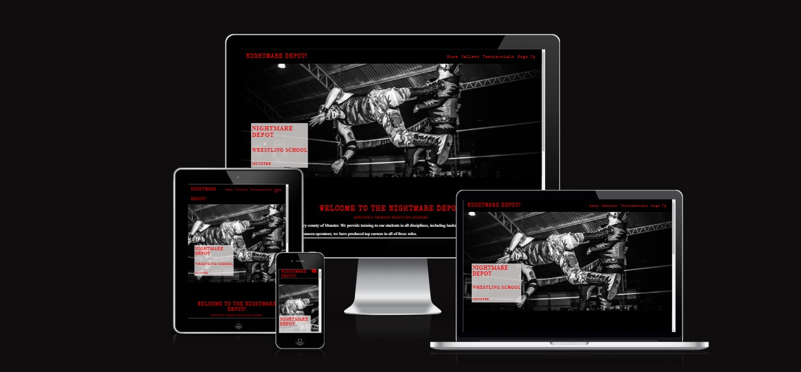

# The Nightmare Depot

The Nightmare Depot is a website designed to provide a resource for aspiring wrestlers to use in order to secure training and booking. Wrestling as an industry has historically been very difficult to enter. This has changed over the past few decades, though charlatans are notorious in the lower ends of the industy.

The aim of The Nightmare Depot is to facilitate contact between prospects and established trainers/promotions. By doing so in a professional manner, The Nightmare Depot hopes to overcome several issues that affect young talent in the industry, such as financial abuse and "trainers" disappearing without notice.

The long term goal of such an endeavour is to support and grow the wrestling industry in Ireland, which has suffered since its inception under illegitimate promoters, low public engagement and the opportunities available abroad enticing talent away. The Ngithmare Depot hopes to provide a pathway to these opportunites for young talent while also fostering a self-reliant system of mutually beneficial promotion across Munster and, once established, Ireland as a whole.

Welcome,

This is the Code Institute student template for Codeanywhere. If you are using Gitpod then you need [this template](https://github.com/Code-Institute-Org/gitpod-full-template) instead.  We have preinstalled all of the tools you need to get started. It's perfectly ok to use this template as the basis for your project submissions.

You can safely delete this README.md file, or change it for your own project. Please do read it at least once, though! It contains some important information about Codeanywhere and the extensions we use. Some of this information has been updated since the video content was created. The last update to this file was: **August 30th, 2023**

## Codeanywhere Reminders

To run a frontend (HTML, CSS, Javascript only) application in Codeanywhere, in the terminal, type:

`python3 -m http.server`

A button should appear to click: _Open Preview_ or _Open Browser_.

To run a frontend (HTML, CSS, Javascript only) application in Codeanywhere with no-cache, you can use this alias for `python3 -m http.server`.

`http_server`

To run a backend Python file, type `python3 app.py`, if your Python file is named `app.py` of course.

A button should appear to click: _Open Preview_ or _Open Browser_.

In Codeanywhere you have superuser security privileges by default. Therefore you do not need to use the `sudo` (superuser do) command in the bash terminal in any of the lessons.

To log into the Heroku toolbelt CLI:

1. Log in to your Heroku account and go to _Account Settings_ in the menu under your avatar.
2. Scroll down to the _API Key_ and click _Reveal_
3. Copy the key
4. In Codeanywhere, from the terminal, run `heroku_config`
5. Paste in your API key when asked

You can now use the `heroku` CLI program - try running `heroku apps` to confirm it works. This API key is unique and private to you so do not share it. If you accidentally make it public then you can create a new one with _Regenerate API Key_.

---

Happy coding!
