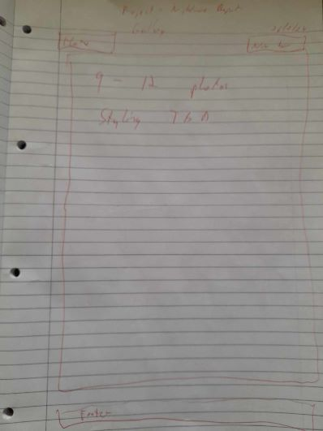
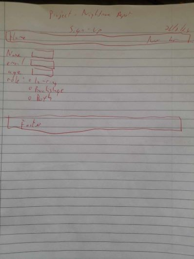
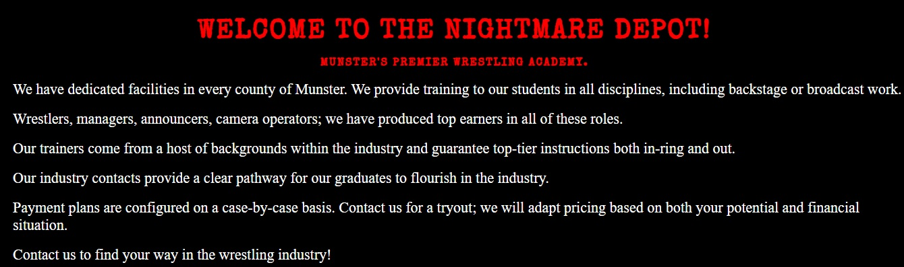

# The Nightmare Depot

The Nightmare Depot is a website designed to provide a resource for aspiring wrestlers to use in order to secure training and booking. Wrestling as an industry has historically been very difficult to enter. This has changed over the past few decades, though charlatans are notorious in the lower ends of the industy.

The aim of The Nightmare Depot is to facilitate contact between prospects and established trainers/promotions. By doing so in a professional manner, The Nightmare Depot hopes to overcome several issues that affect young talent in the industry, such as financial abuse and "trainers" disappearing without notice.

The long term goal of such an endeavour is to support and grow the wrestling industry in Ireland, which has suffered since its inception under illegitimate promoters, low public engagement and the opportunities available abroad enticing talent away. The Ngithmare Depot hopes to provide a pathway to these opportunites for young talent while also fostering a self-reliant system of mutually beneficial promotion across Munster and, once established, Ireland as a whole.

[Live Deployment](https://adamfcode.github.io/nightmare-depot/index.html)

# Wireframes
A decision was made early in the development process to use hand-drawn wireframes in hopes of remaining flexible with finalised designs. Throughout development it became clear that the use of a wireframing application such as balamiq would have been of great benefit to the website. It is with regret that such an application was not used and future developments will make use of such applications to ease the process.

Provided below are photographs of the hand-drawn wireframes which differ in several places from the finalised product.

#### Wireframe for Homepage:

#### Wireframe for Gallery:

#### Wireframe for Testimonials:

#### Wireframe for Sign-up:

# Features

## Navigation Bar
A navigation bar is featured on each page of the website, allowing for easy navigation of the site whether on mobile or desktop. Mobile users are presented with an icon which opens the bar when necessary, whereas desktop users have the listings positioned permanantly at the top of the site.

#### Desktop:

#### Mobile:

## Hero Image
An image of a luchadore deliviering a dropkick to an opponent was selected as the hero image in order to convey the physical nature of the product. Included is an inlay complete with company name and location.

#### Picture of Hero Image

## Welcome Section
A section introducing users to the key concept and intentions of the website is provided below the Hero Image.

#### Picture of Welcome Section

## Join Us Section
Below the welcome section is a list of benefits to joining The Nightmare Depot, delivered in the typical "brass tacks" approach prevalent throughout the independant wrestling scene.

#### Picture of Join Us Section

## Gallery
Accessible from the navigation bar is a gallery section. There are six photographs in this section, each focusing on a different aspect of The Nightmare Depot's operations. Accompanying each photograph is a brief paragraph further detailing the benefits of joining.

#### Picture of Gallery Section

## Testimonials
Accessible from the navigation bar, the testimonial section provides five testimonies from current students and former alumni. Each testimony is delivered in-character as is standard in the wrestling industry. These testimonies are accompanied with a picture of the relevant wrestler.

#### Example from Testimonials Section

## Sign Up Section
Also accessible from the navigation bar, the sign up section provides users with a form they can submit in order to contact The Nightmare Depot. Requested information includes a full name, contact email and wrestling "moniker". Radio buttons provide users with the option to select their desire role. 

#### Picture of Sign Up Form

## Footer
Each page has links included in the footer. Selecting these icons will open a new tab and redirect the user to the relevant website, either a ticket purchasing site or a form of social media. The targetted websites are: Facebook, Eventbrite, TikTok, Instagram and X(formerly twitter). 

#### Picture of the Footer

## Colour Palette
A very basic colour palette was decided upon following research into the independant wrestling scene. These promotions tend to be influenced by musical genres such as punk and metal. Three basic and bold colours which proliferate these scenes were selected in order to emulate and honour the aesthetic.

#### Selected Colour Palette

# Proposed Future Implementations
Deadlines resulted in several features being earmarked for future implementations. Some examples will be provided below.

## Location Page
A page dedicated to providing users with an interactive map displaying the operational locations across Munster. This section would ideally provide drop down menus for each location, allowing users to easily access further information such as opening times and eircodes.

## Tutorial Page
A page featuring several entry-level videos of training across all disciplines. The intention of this section would be to give users an idea of what to expect should they join The Nightmare Depot, as well showcasing the facilities and skilled trainers on offer to students. Also provided would be private videos available to registered users currently enrolled with The Nightmare Depot.

## Interactive Chat 
A feature which would allow users to contact The Nightmare Depot directly on live chat. This would differ from the sign-up section in that it would not be possible to register interest through this chat. Instead, its purpose would be to provide information to the users regarding prices, requirements and expectations., which typically vary from student to student in the wrestling industry.

## Video and Audio Integration
An autoplay, muted video added to the homepage portraying in-ring action would help excite users upon arrival. Also of benefit would be a section allowing users to listen to snippets of wrestler's entrance music, along with links to relevant spotify pages.

## Roster Gallery
A section detailing all current members of The Nightmare Depot. The only people omitted would be students yet to perform live in front of a crowd. This would allow users to see the legitimate talent involved with the operation. Also provided would be links to the wrestlers personal social media in order to drive user engagement with contracted talent.

# Testing
Testing of the website was performed on several devices across several screen sizes throughout development. Several users were invited to test the site on their own devices and report any issues. These issues were then targeted and fixed where possible.

## Identified Issues
The following issues were identified and will be adressed in a future build of the site.

### Sign-up Styling issues
The intention was to have the sign up form centred and more prominent on desktop, much as it is on mobile. The issue was identified late in devlopment and could not be fixed prior to deadline due to styling inconsistencies it caused for the form on mobile.

### Hero Image on Mobile
The Homepage splash image is cropped on mobile, showing the dropkick itself without the contextual imagery of the two wrestlers. Identified as an issue that muddled the intention of the site on first arrival, it unfortunately caused css issues that could not be addressed before deadline.

### Gallery

